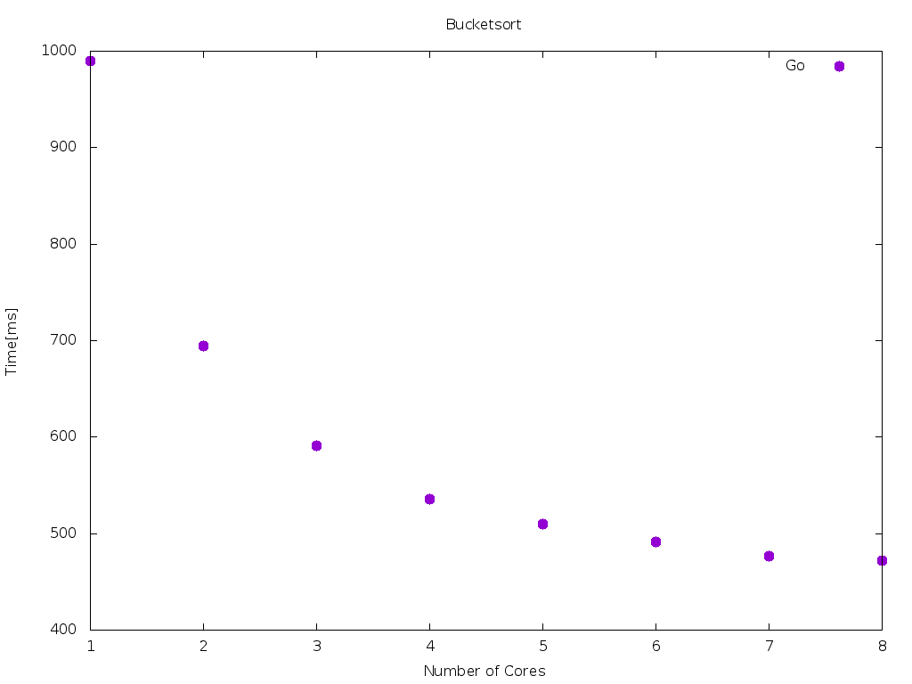
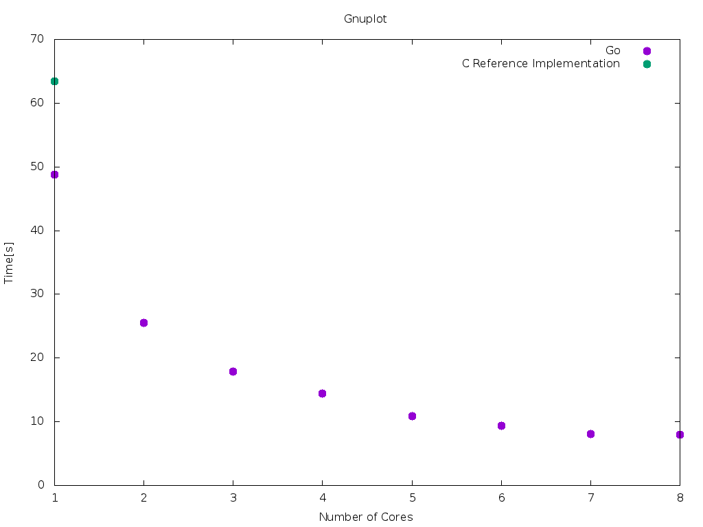

<!--
Multi-Monitor-Shortcuts:
Ctrl-O: Move Window to next screen
Mod4 + Control + j/k: Focus next/previous screen
reveal.js-Shortcuts:
o: Öffne Übersicht
s: Öffne Vortragsmonitor
-->

<!-- .slide: data-state="intro" -->

<!-- .slide: data-state="intro" -->
# FCDS Lab 2015

Jörg Thalheim

<joerg@higgsboson.tk>

Note:
- self-introduction
- 10 minutes to present your solution


## The language: Go

- statically typed
- compiled
- garbage-collected
- object-oriented
- designed with concurrency in mind (goroutines, channels)

Note:
- statically typed, dynamic type dispatching possible
- What you get out of the compiler is a statically linked binary that run on the
  target plattform without any additional libraries
- concurrency as part of the language with goroutines/channels)
- object-oriented: without classes


## The language: Goroutines

<iframe src="http://play.golang.org/p/8XmG8gQv-x" frameborder="0" style="width: 1000px; height: 500px">
  <a href="http://play.golang.org/p/8XmG8gQv-x">see this code in play.golang.org</a>
</iframe>

<!--
```golang
package main

import (
  "fmt"
  "time"
  "runtime"
)

func f(from string) {
    for i := 0; i < 3; i++ {
        fmt.Println(from, ":", i)
        time.Sleep(500 * time.Millisecond)
    }
}

func main() {
    runtime.GOMAXPROCS(2) // schedule on 2 OS-Threads

    go f("goroutine")
    f("direct")

    time.Sleep(1000 * time.Millisecond)
    fmt.Println("finish")
}
```
-->


Note:
- ordinary function f: prints string with incrementing number 3 times a row,
  sleep after each print
- green-thread scheduled by the runtime on a number of os-threads
- advantage: lower overhead then os threads, good for dispatching i/o


## The language: Channels

<iframe src="http://play.golang.org/p/bEnCkiA99F" frameborder="0" style="width: 1000px; height: 500px">
  <a href="http://play.golang.org/p/bEnCkiA99F">see this code in play.golang.org</a>
</iframe>

<!--
```
package main
import "fmt"

func main() {
    messages := make(chan string)
    go func() { messages <- "ping" }()
    msg := <-messages
    fmt.Println(msg)
}
```
-->

Note:
- channels is part of language to pass messages between goroutines


## Current Status

- ready:
  - bucketsort
  - 3sat
- work in progress:
  - haar

Note:
- bucketsort was my first algorithm
- then 3sat
- currently on haar


## Measurement

- for each core 1..8:
  - repeat 10 times
- exclude slowest and fastest execution
- median of execution time

Note:
- run measuresments on the provided 8-core server
- repeat each benchmark for increasing cpu core count 10 times and take the
  execution time
- then I excluded the slowest and fastest execution
- go version
- machine details


## Graphs - Bucketsort


Note:
- C-Implementation was magnitude slower than my application


## Graphs - Bucketsort




Note:
- Here without C-Implementation.


## Graphs - 3Sat




## Optimizations

- buffered i/o
- quicksort as inner sort algorithm in bucketsort
- [profiling](pprof001.html)
- memory-efficient datastructure

```
// 3sat
for c, clause := range s.Clauses {
	// (number XNOR Value) & Mask
	if ((^(number ^ clause.Value)) & clause.Mask) <= 0 {
		break // clause is false
	}
	round = c
}
```

Note:
- use buffered i/o to minimize syscalls
- the inner sort algorithm to sort buckets was very slow
- use go's code profiler, which is included in the standart library to find
  bottlenecks
- where possible I use more efficient datastructure, for 3sat the Clause is
  encoded as a single value, so just 1 bitoperation is needed to evaluate the
  solution


## Optimizations

```
	var wg sync.WaitGroup
	for i, bucket := range buckets {
		wg.Add(1)
		go func(i int, b []uint64) {
			sort.Sort(Uint64Slice(b))
			wg.Done()
		}(i, bucket)
	}
	wg.Wait()
```

Note:
- use waitgroup to synchronize between other group
