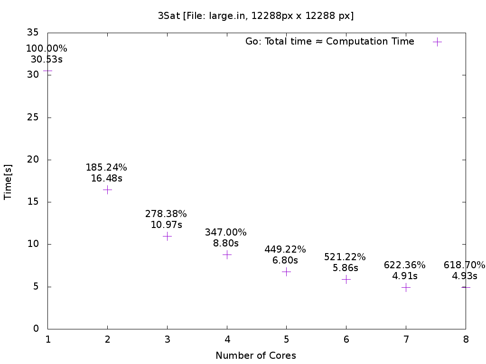

<!--
Multi-Monitor-Shortcuts:
Ctrl-O: Move Window to next screen
Mod4 + Control + j/k: Focus next/previous screen
reveal.js-Shortcuts:
o: Öffne Übersicht
s: Öffne Vortragsmonitor
-->

<!-- .slide: data-state="intro" -->
# FCDS Lab 2015

Jörg Thalheim

<joerg@higgsboson.tk>

## Algorithms

<input type="checkbox" checked> bucketsort 
<input type="checkbox"> friendly 
<input type="checkbox" checked> haar 
<input type="checkbox"> knapsack 
<input type="checkbox" checked> threesat

## Bucketsort: Overview

Note:
  - sequentially fill buckets
  - parallel sort buckets using quicksort
  - synchronize using go wait group (similar to barrier)

## Haar Wavelets: Overview 1

Note:
  - algorithm to prepare image compression -> matrix operation
  - sequentially read/write haar wavelets
  - in a loop, a row transformation, followed by column transformation
  - row transformation is parallized line wise
  - synchronized using go wait group
  - same thing for column transformation

## Haar Wavelets: Overview 2

## Threesat: Overview

Note:
  - parallized searching the keyspace (1,2^Variables)
  - each goroutine, gets an offset in the loop, loop step = number of goroutines
  - channel is used to report results back (similiar to a queue),
    abort when first solution is found or all goroutines have finshed

## Measurement
- for `1` to `8` cpu cores
  - take `10` measurements
    - take computation time (only core algorithm)
    - take total run time (computation time + time spent on I/O)
  - exclude the slowest and fastest measurement
  - average over the remaining `8` measurements
- after each measurement call `sync` command, to flush remaining I/O buffers of the
  operating system

## Bucketsort: Performance

Note:
  - Implementation is much faster than original
  - using quicksort instead of bucketsort
  - encode words as integers
  - scalability problem: fill sequentially buckets (could be parallized)

## Threesat: Performance

Note:
  - scales well
  - encode 3 clauses as a single integer -> only 1 conditional
  - unroll the inner checker loop to reduce loading clauses from memory
  - use unsafe pointer arithmetic in the loop body to improve performance
  - go lacks of optimizations for binary logic

## Haar Wavelets: Performance

Note:
  - scales well
  - unsafe pointer arithmetic to access matrix -> 30% Performance
  - experiments: memory-map input file -> reduce initial waiting time/overall
    time -> worser -> computation time (page fauls during computation)

## Summary: Experience with Go
- robust support for concurrency/parallism
- good standart library: profiler/unit tests/race detector
- room for improvements: compiler optimization
