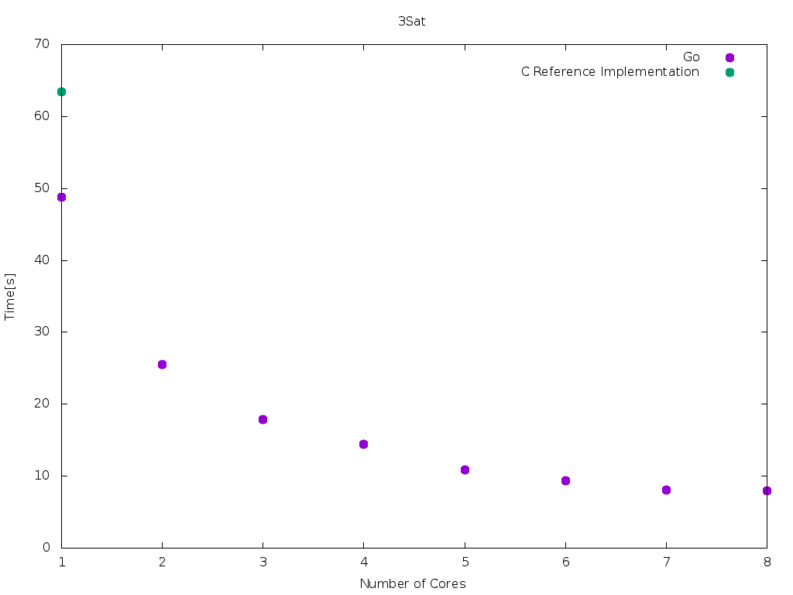

<!-- .slide: data-state="intro" -->
# FCDS Lab 2015

Jörg Thalheim

<joerg@higgsboson.tk>

Note:
- self-introduction
- 10 minutes to present your solution


## The language: Go

- statically typed
- compiled
- garbage-collected
- object-oriented
- designed with concurrency in mind (goroutines, channels)

Note:
- statically typed, dynamic type dispatching possible
- What you get out of the compiler is a statically linked binary that run on the
  target plattform without any additional libraries


## The language: Goroutines

<iframe src="http://play.golang.org/p/8XmG8gQv-x" frameborder="0" style="width: 1000px; height: 500px">
  <a href="http://play.golang.org/p/8XmG8gQv-x">see this code in play.golang.org</a>
</iframe>

<!--
```golang
package main

import (
  "fmt"
  "time"
  "runtime"
)

func f(from string) {
    for i := 0; i < 3; i++ {
        fmt.Println(from, ":", i)
        time.Sleep(500 * time.Millisecond)
    }
}

func main() {
    runtime.GOMAXPROCS(2) // schedule on 2 OS-Threads

    go f("goroutine")
    f("direct")

    time.Sleep(1000 * time.Millisecond)
    fmt.Println("finish")
}
```
-->


Note:
- ordinary function f: prints string with incrementing number 3 times a row,
  sleep after each print
- green-thread scheduled by the runtime on a number of os-threads
- advantage:

- Nice features of the language if it is rather exotic (i.e., not C/C++, Java, Python, C#).
- Implementation details of parallel programming model. E.g., if you use C
Pthreads, you could show a toy example of creating and joining threads.


## The language: Channels

<iframe src="http://play.golang.org/p/bEnCkiA99F" frameborder="0" style="width: 1000px; height: 500px">
  <a href="http://play.golang.org/p/bEnCkiA99F">see this code in play.golang.org</a>
</iframe>

<!--
```
package main
import "fmt"

func main() {
    messages := make(chan string)
    go func() { messages <- "ping" }()
    msg := <-messages
    fmt.Println(msg)
}
```
-->


## Current Status

- ready:
  - bucketsort
  - 3sat
- work in progress:
  - haar

Note:
- bucketsort was my first algorithm
- then 3sat
- currently on haar


## Measurement

- for each core 1..8:
  - repeat 10 times
- exclude slowest and fastest execution
- median of execution time


## Graphs


Note:
- Your current status: which programs you already implemented.


## Graphs


Note:
- Your current status: which programs you already implemented.


## Graphs




## Optimizations

Note:
- A small example of one of the programs to get look&feel of the language/programming model.
- Tricks and optimizations, if any.
